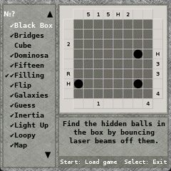

# stppc2x Funkey / RG Nano version
  

Simon Tatham's Portable Puzzle Collection SDL / GP2X version ported for Funkey / RG Nano by joyrider3774,
Based on sources for the SDL GP2X version from [Lee Dowling (ledow)](https://github.com/ledow/stppc2x)

It is is a free collection of logic puzzles and brain teasers created by British programmer Simon Tatham. 
It features various puzzle types such as Sudoku, minesweeper, light-up, and bridges. 
The collection is designed to be portable across multiple platforms (Windows, macOS, Linux, Android, iOS) and 
each puzzle features randomly generated content, providing virtually unlimited gameplay. 
All puzzles include customizable difficulty settings.

Original developper's (Simon Tatham) page is still available [here](https://www.chiark.greenend.org.uk/~sgtatham/puzzles/)

## Screenshots

## RetroFe Preview Image

## Funkey / RG Nano Changes

- Adjusted graphics and code from 320x240 to funkey's 240x240 screen
- Changed key / button layout for funkey
- Made large screen and small screen equal (funkey only supports 240x240), affects maze3d game
- Added (horizontal) Scrollable help texts
- Adjusted ini, save state paths etc to write into HOME folder if that env var exists as opk is readonly
- Music is left out because funkey's sdl did not like mp3's and i did not know if i could convert music to ogg
- Adjusted extra info columns in game list and slightly smaller game list text size
- Removed Screenshot functionality (funkey has its own system)
- Fixed bug related to drawing the end of the game list line
- Fixed description on game list not showing for all games
- Fixed a memory corruption bug making the game constantly crash
- Added a puzzles.c and made 2 declaration inside puzzles.h extern to go around build issue i had
- Increased status bar font size for funkey readability and made sure there is space to display it

## Extra Information

- In the game list the 1st check mark means the game requires number input (L/R button and X and so), the 2nd checkmark means the game has a solver (fn + down)
- when you started a game you can pause the game using start then goto global settings and you can switch between mouse emulation input OR key input which may be easier to control than the mouse emulation. The mouse emulation was the default though and mouse emulation remains in the pause menu
- when you start a game and you pause, you can select different game options in configure game which get applied when you start a new game, and there are also presets, plus you can save a preset with your own settings, generally in this menu on nr's and so, left click (A) means decrease nr / setting, right click (B) means increase number
- the games have undo systems FN + L for undo FN + R for redo
- To Exit the game return to game list (L + R) and press menu / power button
- Maze3d game may be bugged and hard to read, it normally required 640x480
- There is no music included as somehow sdl_mixer on funkey did not want to play mp3's and i was not sure the license of the music allowed me to convert them ogg, the original game also had only music, so it's normal that you hear no sound / music
- for each game you can pause the game and select Help then Game Help to see how to play the games, and you can scroll here horizontally left / right
- you can enable auto save / load in global settings as well so that whenever you quit and restart a game you continue where you left of the previous time you played that game

## Controls Game List

- DPAD: scroll up / down the game list
- Start: start a game
- Power / Menu: Exit game

Hold L when starting a game to skip any saved settings.

## Controls In Game

- DPAD - Move cursor
- A - Left-click
- B - Right-click
- Y - Middle-click
- L - Decrease current digit (some games)
- R - Increase current digit (some games)
- X - Enter current digit (some games)
- Start - Start Game / Pause Game / Enter Menu
- Power / Menu - Restart Game
- Fn / Select + L to Undo.
- Fn / Select + R to Redo.
- Fn / Select + DPAD Down to Solve (some games).
- L+R - Return to the list of games.

## Controls In Menus

- DPAD - Move cursor
- A - Left-click
- B - Right-click
- Y - Middle-click
- X - Save Game Config
- L - Previous Save Slot
- R - Next Save Slot
- Fn / Select + L  - Save Game
- Fn / Select + R  - Load Game
- Start - Unpause Game / Leave Menu
- L+R - Return the list of games

---

ORIGNAL README FROM LEE DOWLING (LEDOW)

---

This is STPPC2x, a port of Simon Tatham's Portable Puzzle Collection to the GP2X handheld console.

Based on Simon Tatham's Portable Puzzle Collection - SVN r8446 - and ported to SDL, with a menu
system and joystick/pad controls, it was intended for the Gamepark GP2X F100 and F200 consoles
but has also been ported to GP2X Wiz by myself, and by others onto everything from the PSP 
(Playstation Portable) to the Nintendo DS.

Built with Open2x toolchain (arm-open2x-linux-apps-gcc-4.1.1-glibc-2.3.6_i686_linux) and 
Open2x pre-compiled libraries (open2x-libpack-20071903-gcc-4.1.1-glibc-2.3.6).  I replaced
libSDL.a with Paeryn's hardware SDL from http://paeryn.myby.co.uk/, the 21Mb version dated 
23/11/07, but they work just fine with the standard Open2x libraries.

Makefile is the GP2X makefile.  Use it with a standard install of the Open2x toolchain 
described above and you can just type "make" to build the GP2X version.  Makefile.PC
builds Linux-based test versions (and also works under Cygwin for building under Windows)
under similar setups.  The executable built from the GP2X Makefile is statically linked 
with all the necessary libraries and is stripped and passed to UPX to compress it
automatically.

I couldn't be bothered to have the Makefile automatically generated from Recipe, sorry.

The code for the SDL version is mostly contained in sdl.c and Makefile but I've had to
tweak various things in the games.  The GP2X Makefile doesn't do the version-magic that 
the original did, ignores all icons and doesn't build some object files that I never used, 
like some of the solvers etc.

Developer documentation for the puzzle collection can be found here:

 http://www.chiark.greenend.org.uk/~sgtatham/puzzles/devel/
